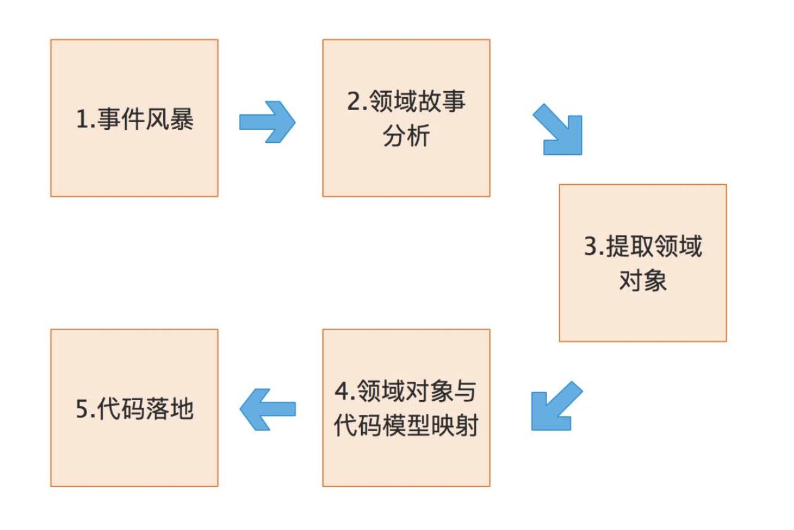
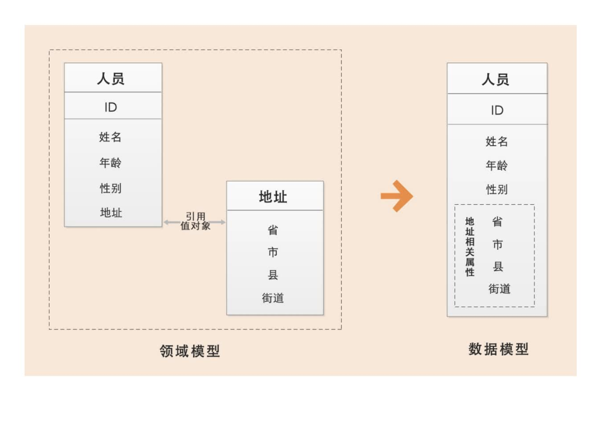
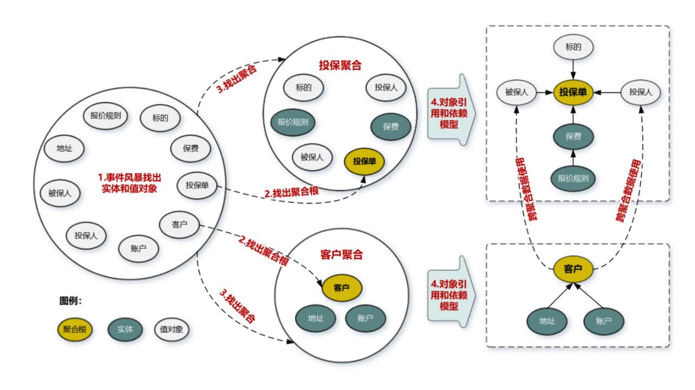
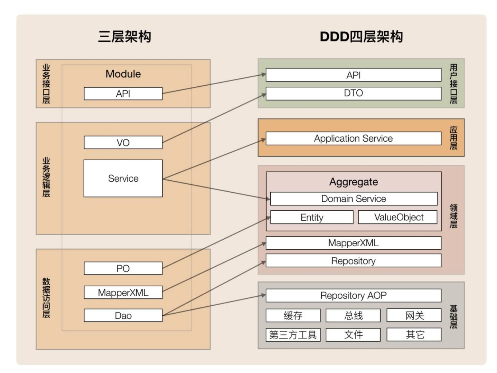
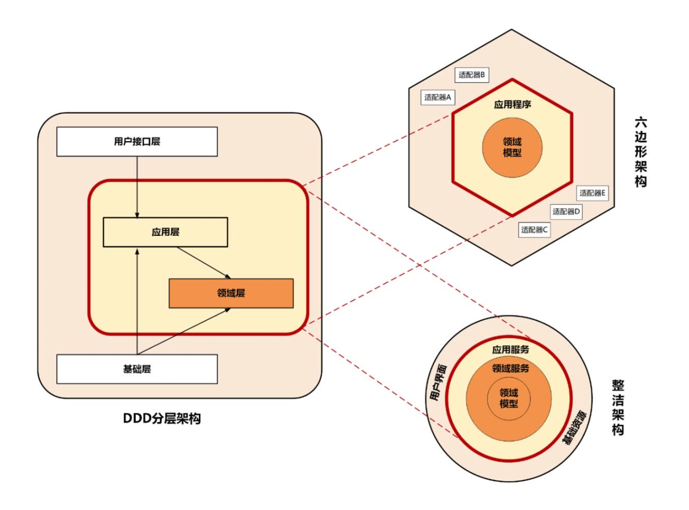

## 领域

​		领域的核心思想就是将问题域逐级细分，来降低业务理解和系统实现的复杂度。通过领域细分，逐步缩小微服务需要解决的问题域，构建合适的领域模型，而领域模型映射成系统就是微服务了。

+ 领域：DDD 的领域就是这个边界内要解决的业务问题域。
+ 子域：领域可以进一步划分为子领域。我们把划分出来的多个子领域称为子域，每个子域对应一个更小的问题域或更小的业务范围。
+ 核心域：决定产品和公司核心竞争力的子域是核心域
+ 通用域： 同时被多个子域使用的通用功能子域是通用域。
+ 支撑域：一种功能子域是必需的，但既不包含决定产品和公司核心竞争力的功能，也不包含通用功能的子域

### 领域边界

​		通用语言定义上下文含义，限界上下文则定义领域边界，

#### 通用语言

​		在事件风暴过程中，通过团队交流达成共识的，能够简单、清晰、准确描述业务涵义和规则的语言就是通用语言。

1. 在事件风暴的过程中，领域专家会和设计、开发人员一起建立领域模型，在领域建模的过程中会形成通用的业务术语和用户故事。事件风暴也是一个项目团队统一语言的过程。
2. 通过用户故事分析会形成一个个的领域对象，这些领域对象对应领域模型的业务对象，每一个业务对象和领域对象都有通用的名词术语，并且一一映射。
3. 微服务代码模型来源于领域模型，每个代码模型的代码对象跟领域对象一一对应。

### 限界上下文

​		确定语义所在的领域边界。用来封装通用语言和领域对象，提供上下文环境，保证在领域之内的一些术语、业务相关对象等（通用语言）有一个确切的含义，没有二义性。

​		限界上下文确定了微服务的设计和拆分方向，是微服务设计和拆分的主要依据。如果不考虑技术异构、团队沟通等其它外部因素，一个限界上下文理论上就可以设计为一个微服务。

## 实体和值对象

实体和值对象是微服务底层的最基础的对象，一起实现实体最基本的核心领域逻辑。

DDD 提倡从领域模型设计出发，而不是先设计数据模型。

		在领域模型中人员是实体，地址是值对象，地址值对象被人员实体引用。在数据模型设计时，地址值对象可以作为一个属性集整体嵌入人员实体中，组合形成上图这样的数据模型；也可以以序列化大对象的形式加入到人员的地址属性中，前面表格有展示。

## 聚合与聚合根

+ 聚合：领域模型内的实体和值对象就好比个体，而能让实体和值对象协同工作的组织就是聚合，它用来确保这些领域对象在实现共同的业务逻辑时，能保证数据的一致性。
+ 聚合根：如果把聚合比作组织，那聚合根就是这个组织的负责人。聚合根也称为根实体，它不仅是实体，还是聚合的管理者。

聚合的特点：高内聚、低耦合，它是领域模型中最底层的边界，可以作为拆分微服务的最小单位，但我不建议你对微服务过度拆分。但在对性能有极致要求的场景中，聚合可以独立作为一个微服务，以满足版本的高频发布和极致的弹性伸缩能力。一个微服务可以包含多个聚合，聚合之间的边界是微服务内天然的逻辑边界。有了这个逻辑边界，在微服务架构演进时就可以以聚合为单位进行拆分和组合了，微服务的架构演进也就不再是一件难事了。

聚合根的特点：聚合根是实体，有实体的特点，具有全局唯一标识，有独立的生命周期。一个聚合只有一个聚合根，聚合根在聚合内对实体和值对象采用直接对象引用的方式进行组织和协调，聚合根与聚合根之间通过 ID 关联的方式实现聚合之间的协同。

实体的特点：有 ID 标识，通过 ID 判断相等性，ID 在聚合内唯一即可。状态可变，它依附于聚合根，其生命周期由聚合根管理。实体一般会持久化，但与数据库持久化对象不一定是一对一的关系。实体可以引用聚合内的聚合根、实体和值对象。

值对象的特点：无 ID，不可变，无生命周期，用完即扔。值对象之间通过属性值判断相等性。它的核心本质是值，是一组概念完整的属性组成的集合，用于描述实体的状态和特征。值对象尽量只引用值对象。

## 领域事件

领域事件是领域模型中非常重要的一部分，用来表示领域中发生的事件。一个领域事件将导致进一步的业务操作，在实现业务解耦的同时，还有助于形成完整的业务闭环。

## 有效降低层与层之间的依赖

1. 用户接口层：用户接口层负责向用户显示信息和解释用户指令。这里的用户可能是：用户、程序、自动化测试和批处理脚本等等。
2. 应用层：应用层是很薄的一层，理论上不应该有业务规则或逻辑，主要面向用例和流程相关的操作。但应用层又位于领域层之上，因为领域层包含多个聚合，所以它可以协调多个聚合的服务和领域对象完成服务编排和组合，协作完成业务操作。应用服务是在应用层的，它负责服务的组合、编排和转发，负责处理业务用例的执行顺序以及结果的拼装，以粗粒度的服务通过 API 网关向前端发布。还有，应用服务还可以进行安全认证、权限校验、事务控制、发送或订阅领域事件等。
3. 领域层：领域层的作用是实现企业核心业务逻辑，通过各种校验手段保证业务的正确性。领域层主要体现领域模型的业务能力，它用来表达业务概念、业务状态和业务规则。领域模型的业务逻辑主要是由实体和领域服务来实现的，其中实体会采用充血模型来实现所有与之相关的业务功能。其次，你要知道，实体和领域对象在实现业务逻辑上不是同级的，当领域中的某些功能，单一实体（或者值对象）不能实现时，领域服务就会出马，它可以组合聚合内的多个实体（或者值对象），实现复杂的业务逻辑。
4. 基础层：基础层是贯穿所有层的，它的作用就是为其它各层提供通用的技术和基础服务，包括第三方工具、驱动、消息中间件、网关、文件、缓存以及数据库等。比较常见的功能还是提供数据库持久化。

`每层只能与位于其下方的层发生耦合。`

### 3层架构演进DDD分层架构

## 3种微服务架构对比

中台本质上是领域的子域，它可能是核心域，也可能是通用域或支撑域。通常大家认为阿里的中台对应 DDD 的通用域，将通用的公共能力沉淀为中台，对外提供通用共享服务。

## 中台

中台来源于平台，但中台和平台相比，它更多体现的是一种理念的转变，它主要体现在这三个关键能力上：对前台业务的快速响应能力；企业级复用能力；从前台、中台到后台的设计、研发、页面操作、流程服务和数据的无缝联通、融合能力。

中台的本质其实就是提炼各个业务板块的共同需求，进行业务和系统抽象，形成通用的可复用的业务模型，打造成组件化产品，供前台部门使用。前台要做什么业务，需要什么资源，可以直接找中台，不需要每次都去改动自己的底层。

数据中台的主要目标是打通数据孤岛，实现业务融合和创新，包括三大主要职能：

+ 完成企业全域数据的采集与存储，实现各不同业务类别中台数据的汇总和集中管理。
+ 按照标准的数据规范或数据模型，将数据按照不同主题域或场景进行加工和处理，形成面向不同主题和
+ 建立业务需求驱动的数据体系，基于各个维度的数据，深度萃取数据价值，支持业务和商业模式的创新。

前台主要面向客户以及终端销售者，实现营销推广以及交易转化；中台主要面向运营人员，完成运营支撑；后台主要面向后台管理人员，实现流程审核、内部管理以及后勤支撑，比如采购、人力、财务和 OA 等系统。