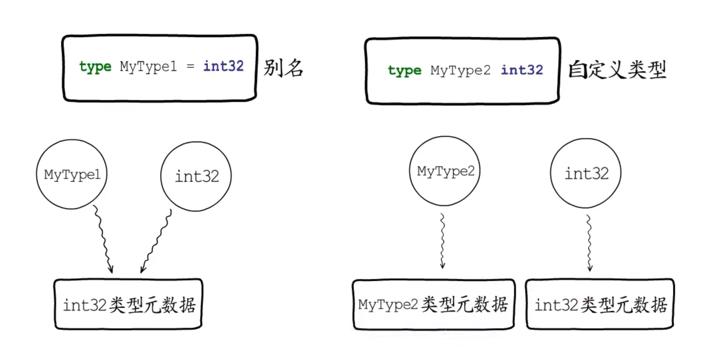
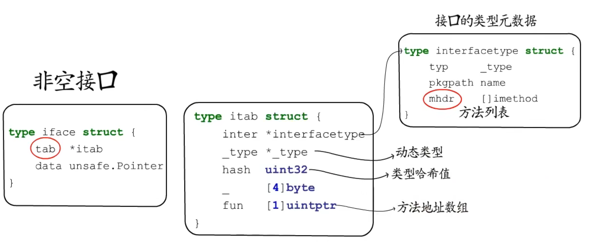
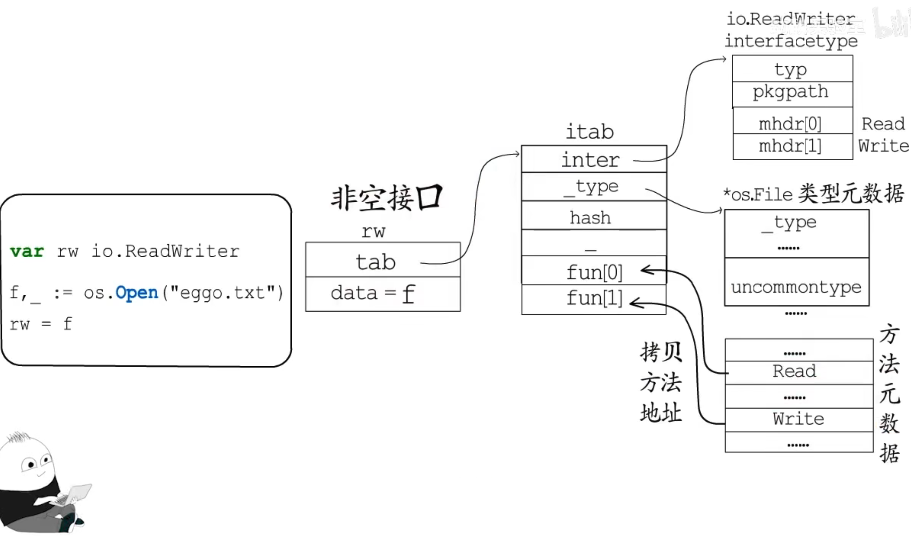

+ 内置类型：built-in
+ 类型元数据：runtime._type

> 自定义类型与类型别名

> 接口

+ 空接口interface{}: runtime.eface

+ 非空接口: runtime.iface

> 类型断言

+ 空接口判断_type_
+ 非空接口判断_tab

> reflect 将类型元数据暴露给用户使用

 参数为空接口类型，通过传递拷贝后变量的地址进行传递来实现传值的语义

> T和*T的方法集

+ 编译器会为*T生成T的方法的包装方法为了支持接口

+ *T调用T的方法，是一种语法糖，通过指针解引用

+ 接口不能直接使用接收者为值类型的方法

+ *T方法包含所有T方法？链接器会把没用的方法裁剪掉 ，不能通过反射去验证，反射也算是用到所有方法，只能通过执行文件分析

  

> 泛型与空接口

+ 给空接口赋值 值类型会发生装箱造成变量逃逸 
+ 泛型本质是编译时生成对应的一套代码，会导致可执行代码增多
+ 空接口主要用来实现语言的动态特性