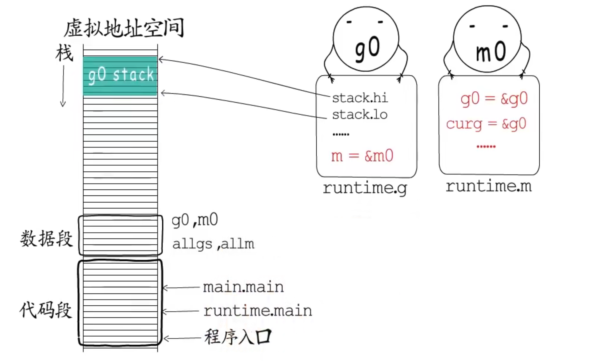

> 程序入口

osinit->schedinit->mstart->schedule()->runtime.main->main.main->exit/goexit()

g0: 主协程，在主线程栈上分配 

m0：主线程对应的M

>  协程创建

以go hello()为例

1.  调用newproc()函数，切换到g0栈(空间大)调用newproc1；//no-split不支持栈增长  
2. newproc1: 
   1. acquirem禁止m被抢占->gfget(_p_)获取空闲的g，没有就创建一个并加入到allgs,此时这个g的状态为_Gdead 
   2. memmove 拷贝参数到新建的协程栈中.&goexit()+1入栈，可以理解为在goexit（）函数中调用了hello函数
   3. 设置g的startpc（函数入口地址）,gopc（父协程调用newproc后的返回地址 ）,g.sched保存执行现场（sp/pc）
   4. 设置g的goid,将g状态设置为_Grunnable,通过runqput放到p的本地runq中
   5. wakep() ,releasem
   6. 等待g得到调度执行通过g.sched恢复现场就可以从用户函数入口执行了
   7. 函数结束后返回到goexit()中执行协程资源回收工作     

>  协程挂起 runtime.gopark

1. acquirem,将g的状态有_Grunning->_Gwaiting
2. releasem
3. mcall(park_m)
   1. 保存当前g的执行现场，切换到g0
   2. call runtime.park_m,将当前m的curg置为nil
   3. 通过schedul()寻找待执行的g 

> 协程恢复 runtime.goready

1. 切换到g0，执行runtime.ready 
2. 将g的状态Gwaitting->Grunnable
3. runqput放到p的本地runq

> 调度循环  

+ netpoll: 主动轮询IO事件监听队列

+ sysmon任务
  + 保证timer执行
  + 执行netpoll
  + 执行gc 
  + 执行抢占：监控线程通过schedtick,sysmontick.scheduwhen记录调度时间判断g执行时间是否过长
    + stackPreempt：通过栈增长，设置stackguard0==stackPreempt, runtime.newstack判断前面条件后进行一次协程调度
    + asyncPreempt：unix: 发送sigPreempt信号中断->runtime.sighandler->注入asyncPreempt->schedule
    + 抢占系统调用中的P ：发生系统调用的g切换到g0栈 ，m与g绑定，用不到p,m与p解绑 (m.oldp=p),m恢复后会先检查之前p是否被占用，否则acquirep，否则放到全局runq

Schedul():M 找到待执行的G

1. 确定m.lockedg!=0, 是否绑定了g,如果绑定了g（例如进行系统调用），要等到g重新调度时唤醒M继续执行
2. m没有绑定g,判断sched.gcwaiting!=0,是否有gc在等待执行，进行赋值gc后再执行调度程序
3. checkTimers,检查是否有要执行的timer
4. 一定几率获取一部分全局runq到本地runq，p.schedick%61==0
5. Findrunnable()获取待执行的g, gcwaiting->local runq->global runq->netpoll->seal ther p
6. 获取到一个g后，判断g.lockedm!=0，是否有绑定的m，有的话重新schedule
7. Execute 执行g,绑定m和q，修改g的状态Grunnable->Grunning,p.schedtick++,调gogo(g.sched)恢复执行现场