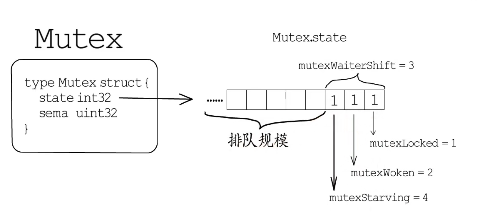
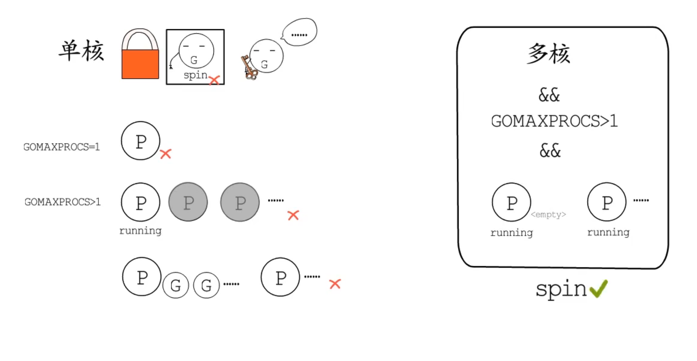

```go
type Mutex struct{
  state int32
  sema uint32
}
```

> 正常模式

1. 先自旋尝试获取锁，通过原子操作
2. 通过信号量排队等待
3. 当锁被释放，唤醒者和后来者（处于自旋阶段，未加入等待队列，正在CPU上运行）需要竞争锁  ，被唤醒者拿不到锁重新插入队列头部

> 饥饿模式：当有g等等待时间超过1ms

1. 当锁被释放，锁直接给到等待队列的第一个，后来者不会自旋，直接加入队列尾部 

切换回正常模式：

+ 当获得锁的g等待时间小于1ms
+ 获得锁的g是队列中的最后一个




> lock slowpath




+ 单核，单p或只有一个运行的p,p的runq不为空时不自旋
+ 多核，p>1且至少有一个其它p running且p的runq为空
+ mutex自旋底层是procyield循环执行30次PAUSE指令，上限次数为4，每次都会判断是否需要自旋

1. 自旋的g会先设置woken标志位，目的是为了在正常模式下告知持有锁的的g在unlock时不用唤醒其他g,避免太多的g等待
2.  结束自旋或不用自旋的g尝试原子操作修改mutex状态，把此时的state保存到old,把要修改为的state记为new 
   1. 如果old处于饥饿模式或加锁状态    ，g要去排队，排队规模+1
   2. 正常模式尝试标记lock为
   3. 如果当前g等待时间超过1ms,且锁没被释放， 将mutex切换为饥饿模式 

3. 重置woken标志位 
4. 如果抢锁成功，结束slowpath
5. 如果排队成功，判断是加入队列头还是尾
6. g被唤醒时，当前是正常模式，继续自旋流程，饥饿模式直接获取锁，在判断是否要切换回正常模式


> unlock slowpath

1. 如果锁处在正常模式，等待队列为空，或已经有其它g被唤醒（上面讲到的自旋）,或获得了锁  ，或锁进入饥饿模式，那就不需唤醒g,直接结束 
2. 抢占woken标志位成功，runtime.semrelease唤醒一个g 
3. 抢占失败循环重试
4. 饥饿模式下释放锁直接将锁传递给第一个等待者


>信号量

runtime.semaTable: 251颗平衡数的根，平衡树的每个节点都是一个sudog对象 

通过&sema找到semaTable的位置，再找到具体节点实现排队队列

