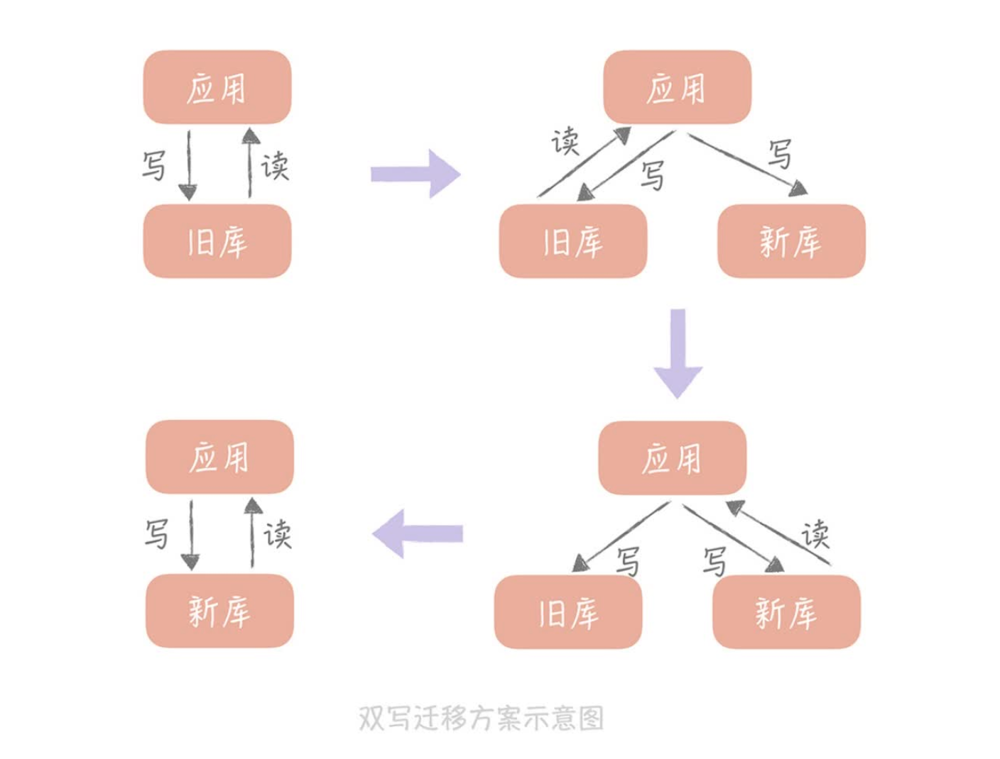
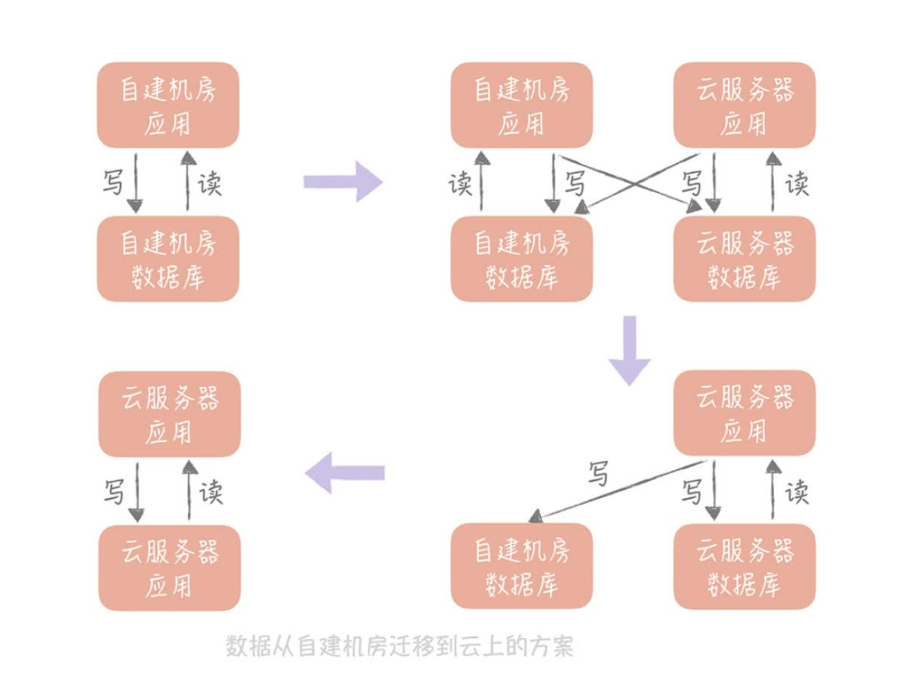

#### 缓存使用-读写策略

1. Cache Aside 是我们在使用分布式缓存时最常用的策略，你可以在实际工作中直接拿来使用。

+ 读策略的步骤是：

​       从缓存中读取数据；如果缓存命中，则直接返回数据；如果缓存不命中，则从数据库中查询数据；查询到数据后，将数据写入到缓存中，并且返回给用户。

+ 写策略的步骤是：

​       更新数据库中的记录；删除缓存记录。

2. Read/Write Through 和 Write Back 策略需要缓存组件的支持，所以比较适合你在实现本地缓存组件的时候使用；
   + 这个策略的核心原则是用户只与缓存打交道，由缓存和数据库通信，写入或者读取数据。
3. Write Back 策略是计算机体系结构中的策略，不过写入策略中的只写缓存，异步写入后端存储的策略倒是有很多的应用场景
   + 这个策略的核心思想是在写入数据时只写入缓存，并且把缓存块儿标记为“脏”的。而脏块儿只有被再次使用时才会将其中的数据写入到后端存储中。

#### 缓存高可用

+ 客户端方案就是在客户端配置多个缓存的节点，通过缓存写入和读取算法策略来实现分布式，从而提高缓存的可用性。

  一致性hash(虚拟节点)

+ 中间代理层方案是在应用代码和缓存节点之间增加代理层，客户端所有的写入和读取的请求都通过代理层，而代理层中会内置高可用策略，帮助提升缓存系统的高可用。

+ 服务端方案就是 Redis 2.4 版本后提出的 Redis Sentinel 方案。

#### 缓存穿透

`解决缓存穿透问题的核心目标在于减少对于数据库的并发请求。`

+ 回种空值

  向缓存中回种一个空值，并设置较短的过期时间。

  回种空值虽然能够阻挡大量穿透的请求，但如果有大量获取未注册用户信息的请求，缓存内就会有有大量的空值缓存，也就会浪费缓存的存储空间，如果缓存空间被占满了，还会剔除掉一些已经被缓存的用户信息反而会造成缓存命中率的下降。

+ 布隆过滤器

  缺陷：

  1. 它在判断元素是否在集合中时是有一定错误几率的，比如它会把不是集合中的元素判断为处在集合中；

     使用多个 Hash 算法为元素计算出多个 Hash 值，只有所有 Hash 值对应的数组中的值都为1时，才会认为这个元素在集合中。

  2. 不支持删除元素。

     数组中不再只有 0 和 1 两个值，而是存储一个计数。比如如果 A 和 B 同时命中了一个数组的索引，那么这个位置的值就是 2，如果 A 被删除了就把这个值从 2 改为 1。

#### 数据的迁移

+ 双写

+ 级联

