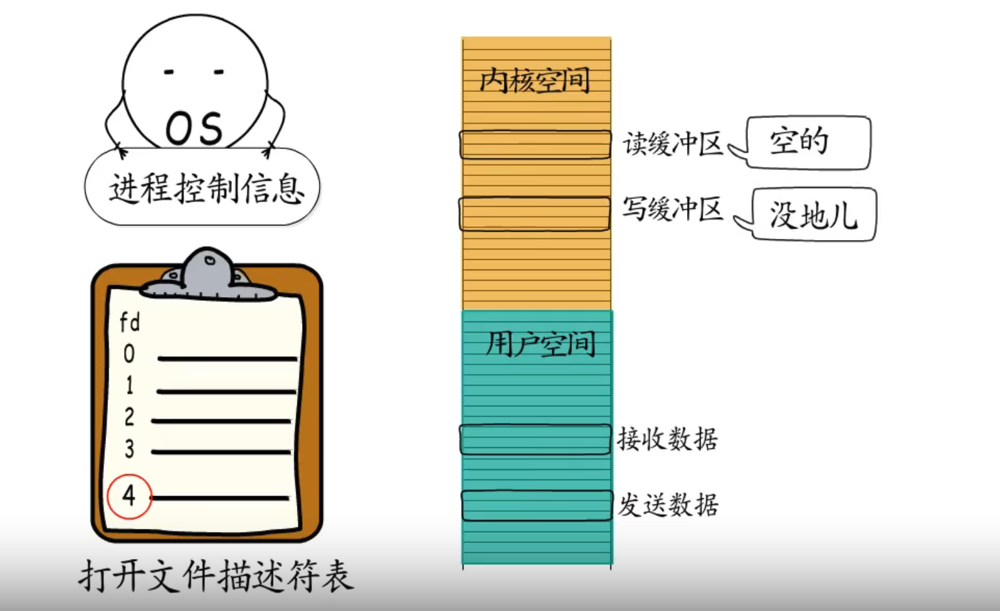
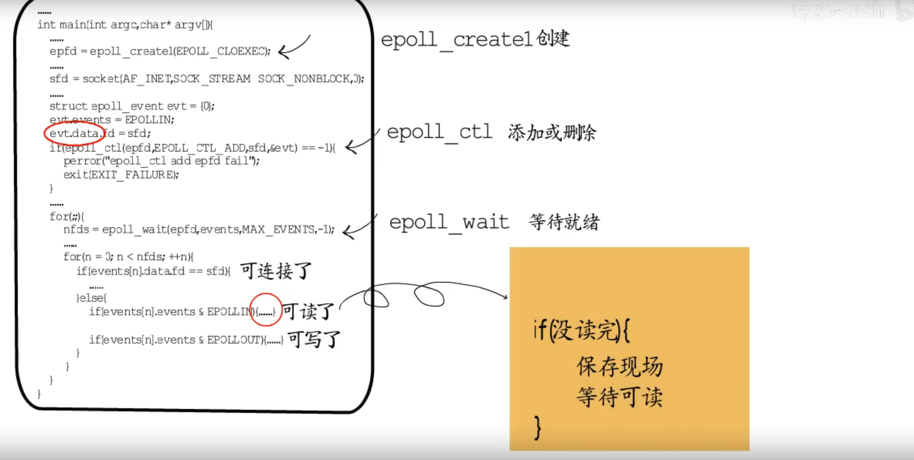

### 协程

+ 线程中的执行体，用户态线程，只有用户栈，没有内核栈
+ 每个协程有自己的执行栈，可以保存自己的执行线程，用户态进程调度

### IO多路复用

#### 阻塞式IO

 线程让出CPU进入等待队列，等socket就绪后获得时间片继续执行   

#### 非阻塞式IO

 不让出CPU，频繁检查socket是否就绪，一种“忙等待”方式，耗CPU，加剧延时

#### IO多路复用

操作系统提供支持，将需要等待的socket加入监听集合 ，通过1次系统调用同时监听多个socket

> select 等待有事件就绪或超时就会返回

1. 传入fd_set 只有1024位，只能监听1024个fd
2. 每次传入所有监听集合，内核态用户态数据拷贝频繁
3. 返回后，每次遍历所有集合

> poll 

采用struct传递fd,数量不受限制，但其它问题依然存在

> epoll

Epoll_creat: 创建一个epoll并获取一个句柄

Epoll_ctl: 用于添加或删除fd与对应的事件信息

Epoll_wati: 返回已经就绪的fd 

