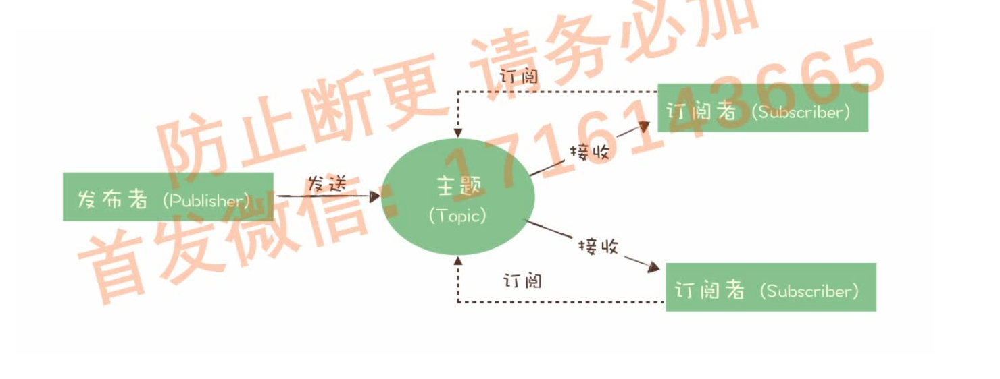
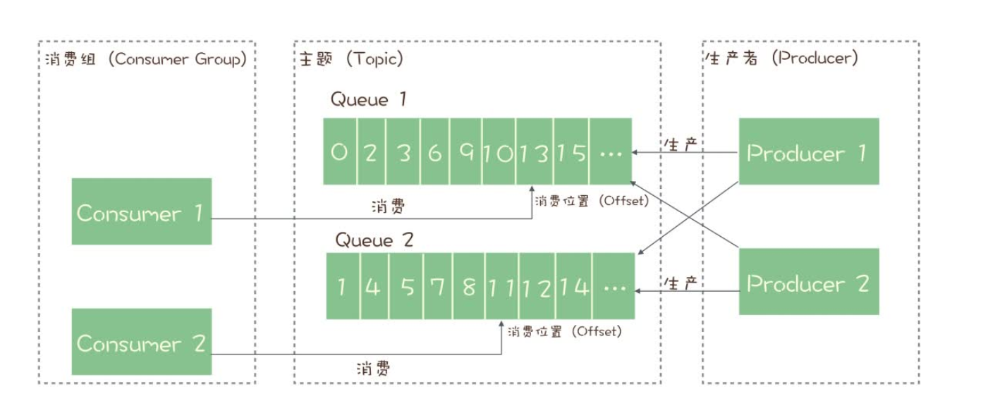

# 主题和队列的区别

#### 队列模型

#### 订阅发布模型

`它们最大的区别其实就是，一份消息数据能不能被消费多次的问题。`

##### RabbitMQ解决多消费者问题

##### RocketMQ消费模型

每个主题包含多个队列，通过多个队列来实现多实例并行生产和消费。需要注意的是，RocketMQ 只在队列上保证消息的有序性，主题层面是无法保证消息的严格顺序的。

RocketMQ 中，订阅者的概念是通过消费组（Consumer Group）来体现的。每个消费组都消费主题中一份完整的消息，不同消费组之间消费进度彼此不受影响，也就是说，一条消息被 Consumer Group1 消费过，也会再给 Consumer Group2 消费。

消费组中包含多个消费者，同一个组内的消费者是竞争消费的关系，每个消费者负责消费组内的一部分消息。如果一条消息被消费者 Consumer1 消费了，那同组的其他消费者就不会再收到这条消息。

在 Topic 的消费过程中，由于消息需要被不同的组进行多次消费，所以消费完的消息并不会立即被删除，这就需要 RocketMQ 为每个消费组在每个队列上维护一个消费位置（Consumer Offset），这个位置之前的消息都被消费过，之后的消息都没有被消费过，每成功消费一条消息，消费位置就加一。这个消费位置是非常重要的概念，我们在使用消息队列的时候，丢消息的原因大多是由于消费位置处理不当导致的。