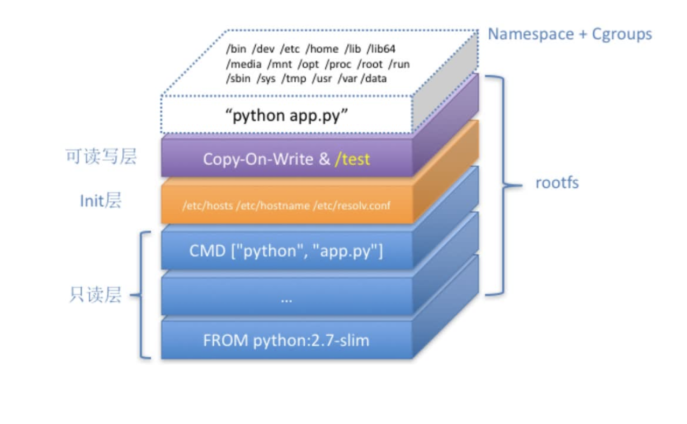
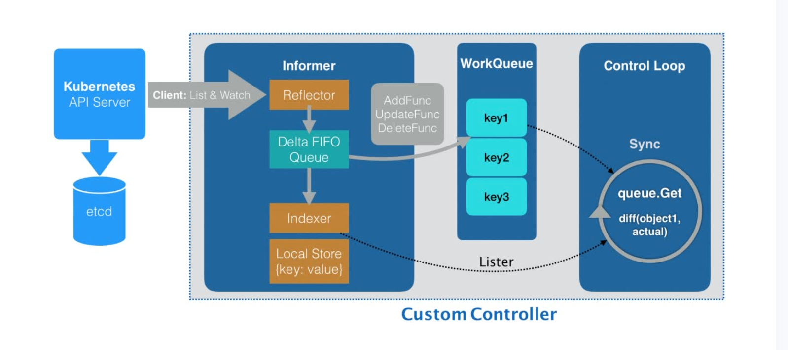
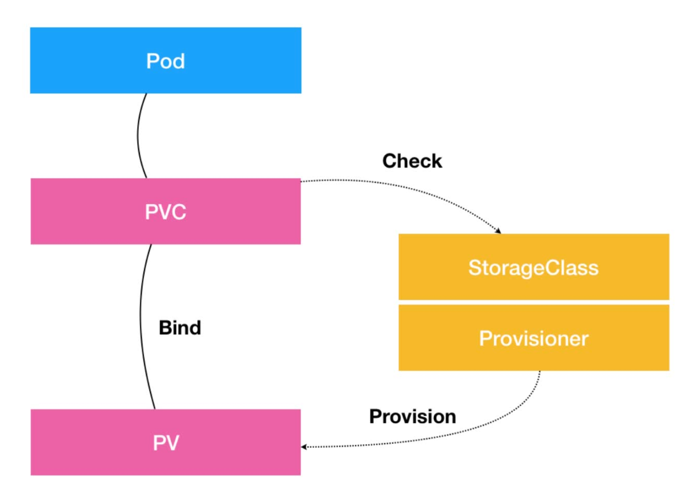
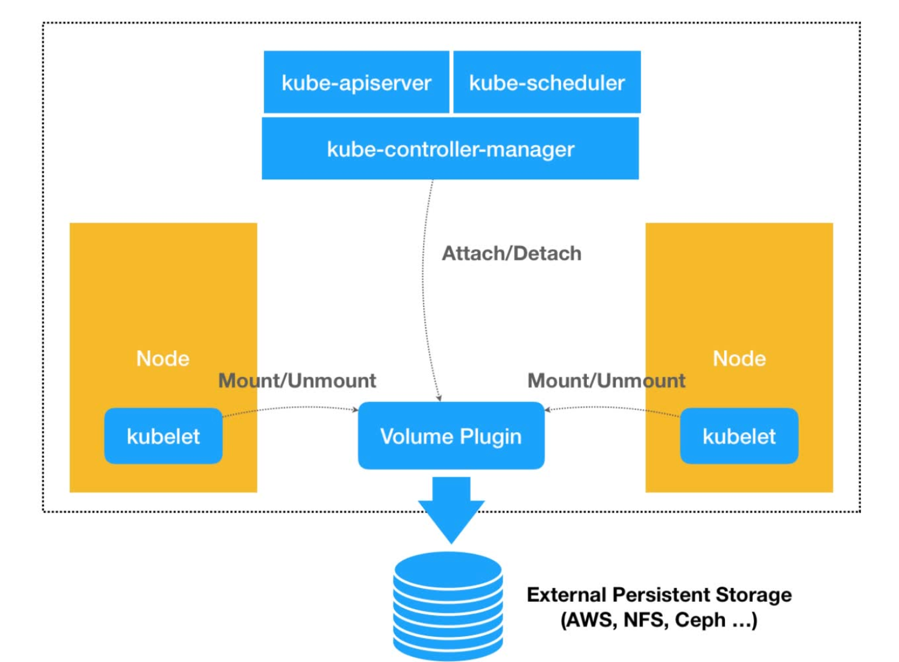
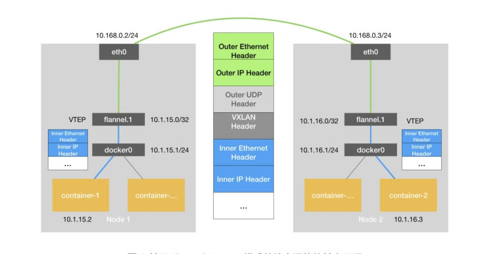
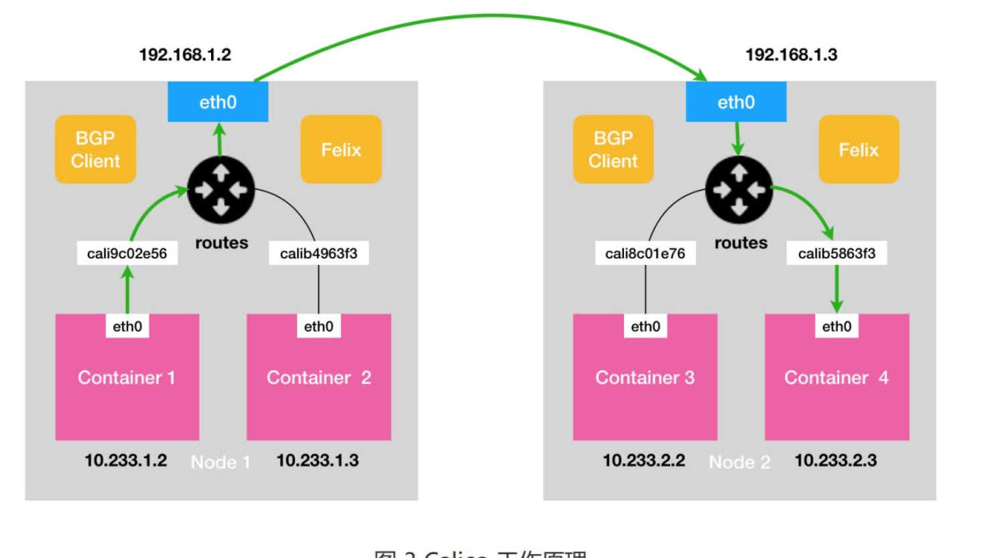
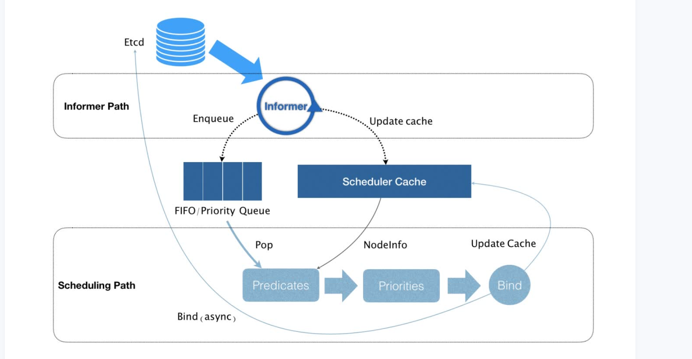

#### 隔离与限制

基于 Linux Namespace 的隔离机制相比于虚拟化技术也有很多不足之处，其中最主要的问题就是：隔离得不彻底。

+ 首先，既然容器只是运行在宿主机上的一种特殊的进程，那么多个容器之间使用的就还是同一个宿主机的操作系统内核。
+ 其次，在 Linux 内核中，有很多资源和对象是不能被 Namespace 化的，最典型的例子就是：时间。
  + 尽管在实践中我们确实可以使用 Seccomp 等技术，对容器内部发起的所有系统调用进行过滤和甄别来进行安全加固，但这种方法因为多了一层对系统调用的过滤，一定会拖累容器的性能。何况，默认情况下，谁也不知道到底该开启哪些系统调用，禁止哪些系统调用。

Linux Cgroups 就是 Linux 内核中用来为进程设置资源限制的一个重要功能。

Linux Cgroups 的全称是 Linux Control Group。它最主要的作用，就是限制一个进程组能够使用的资源上限，包括 CPU、内存、磁盘、网络带宽等等。

+ 问题：

众所周知，Linux 下的 /proc 目录存储的是记录当前内核运行状态的一系列特殊文件，用户可以通过访问这些文件，查看系统以及当前正在运行的进程的信息，比如 CPU 使用情况、内存占用率等，这些文件也是 top 指令查看系统信息的主要数据来源。但是，你如果在容器里执行 top 指令，就会发现，它显示的信息居然是宿主机的 CPU 和内存数据，而不是当前容器的数据。造成这个问题的原因就是，/proc 文件系统并不知道用户通过 Cgroups 给这个容器做了什么样的资源限制，即：/proc 文件系统不了解 Cgroups 限制的存在。

+ 解决办法：

把宿主机的 /var/lib/lxcfs/proc/memoinfo 文件挂载到Docker容器的/proc/meminfo位置后。容器中进程读取相应文件内容时，LXCFS的FUSE实现会从容器对应的Cgroup中读取正确的内存限制。

#### 容器镜像

对 Docker 项目来说，它最核心的原理实际上就是为待创建的用户进程：

1. 启用 Linux Namespace 配置；
2. 设置指定的 Cgroups 参数；
3. 切换进程的根目录（Change Root）。

+ rootfs:它只是一个操作系统的所有文件和目录，并不包含内核，最多也就几百兆。而相比之下，传统虚拟机的镜像大多是一个磁盘的“快照”，磁盘有多大，镜像就至少有多大。

+ 通过结合使用 Mount Namespace 和 rootfs，容器就能够为进程构建出一个完善的文件系统隔离环境。当然，这个功能的实现还必须感谢 chroot 和 pivot_root 这两个系统调用切换进程根目录的能力。
+ 在一个正确的时机，进行一次绑定挂载，Docker 就可以成功地将一个宿主机上的目录或文件，不动声色地挂载到容器中。

#### 为什么需要POD

k8S比作操作系统的话，容器就是一个个进程，pod就是虚拟机

+ Pod，实际上是在扮演传统基础设施里“虚拟机”的角色；而容器，则是这个虚拟机里运行的用户程序。

+ Pod 最重要的一个事实是：它只是一个逻辑概念。
+ Pod 里的所有容器，共享的是同一个 Network Namespace，并且可以声明共享同一个 Volume。

#### 深入解析pod

+ 凡是调度、网络、存储，以及安全相关的属性，基本上是 Pod 级别的。

#### 控制器模型

+ Deployment 实际上是一个两层控制器。首先，它通过ReplicaSet 的个数来描述应用的版本；然后，它再通过ReplicaSet 的属性（比如 replicas的值），来保证 Pod 的副本数量。

+ StatefulSet 的设计其实非常容易理解。它把真实世界里的应用状态，抽象为了两种情况：

  1.拓扑状态。这种情况意味着，应用的多个实例之间不是完全对等的关系。这些应用实例，必须按照某些顺序启动，比如应用的主节点 A 要先于从节点 B 启动。而如果你把 A和 B 两个 Pod 删除掉，它们再次被创建出来时也必须严格按照这个顺序才行。并且，新创建出来的 Pod，必须和原来 Pod 的网络标识一样，这样原先的访问者才能使用同样的方法，访问到这个新 Pod。

  2.存储状态。这种情况意味着，应用的多个实例分别绑定了不同的存储数据。对于这些应用实例来说，Pod A 第一次读取到的数据，和隔了十分钟之后再次读取到的数据，应该是同一份，哪怕在此期间 Pod A 被重新创建过。这种情况最典型的例子，就是一个数据库应用的多个存储实例。所以，StatefulSet 的核心功能，就是通过某种方式记录这些状态，然后在 Pod 被重新创建时，能够为新 Pod 恢复这些状态。

+ Headless Service 不需要分配一个 VIP，而是可以直接以 DNS 记录的方式解析出被代理 Pod 的 IP 地址。
+ StatefulSet 这个控制器的主要作用之一，就是使用 Pod 模板创建 Pod 的时候，对它们进行编号，并且按照编号顺序逐一完成创建工作。而当StatefulSet 的“控制循环”发现 Pod 的“实际状态”与“期望状态”不一致，需要新建或者删除 Pod 进行“调谐”的时候，它会严格按照这些 Pod编号的顺序，逐一完成这些操作。

#### 声明式API

+ 首先，所谓“声明式”，指的就是我只需要提交一个定义好的 API 对象来“声明”，我所期望的状态是什么样子。
+ 其次，“声明式 API”允许有多个 API 写端，以 PATCH 的方式对 API 对象进行修改，而无需关心本地原始 YAML 文件的内容。
+ 最后，也是最重要的，有了上述两个能力，Kubernetes 项目才可以基于对 API 对象的增、删、改、查，在完全无需外界干预的情况下，完成对“实际状态”和“期望状态”的调谐（Reconcile）过程。

##### Dynamic Admission Controller

k8s initializer的原理，在pod的metadata中添加initializers  pedding字段，进入Admission Controller处理完成后将字段删除

一个 API 对象在 Etcd 里的完整资源路径，是由：Gro

#### 自定义控制器

+ 所谓 Informer，其实就是一个带有本地缓存和索引机制的、可以注册 EventHandler 的 client。它是自定义控制器跟 APIServer 进行数据同步的重要组件。
+ Informer 通过一种叫作 ListAndWatch 的方法，把 APIServer 中的 API 对象缓存在了本地，并负责更新和维护这个缓存。

#### PV,PVC,StorageClass

+ PVC 描述的，是 Pod 想要使用的持久化存储的属性，比如存储的大小、读写权限等。

+ PV 描述的，则是一个具体的 Volume 的属性，比如 Volume 的类型、挂载目录、远程存储服务器地址等。

+ 而 StorageClass 的作用，则是充当 PV 的模板。并且，只有同属于一个 StorageClass的 PV 和 PVC，才可以绑定在一起。

#### CSI

#### CNI

##### Fannel原理

> host-gw

##### calico

+ BGP 的全称是 Border Gateway Protocol，即：边界网关协议。它是一个 Linux 内核原生就支持的、专门用在大规模数据中心里维护不同的“自治系统”之间路由信息的、无中心的路由协议。
+ 所谓 BGP，就是在大规模网络中实现节点路由信息共享的一种协议。而 BGP 的这个能力，正好可以取代 Flannel 维护主机上路由表的功能。而且，BGP 这种原生就是为大规模网络环境而实现的协议，其可靠性和可扩展性，远非 Flannel 自己的方案可比。

Calico 项目的架构就非常容易理解了。它由三个部分组成：

1. Calico 的 CNI 插件。这是 Calico 与 Kubernetes 对接的部分。
2. Felix。它是一个 DaemonSet，负责在宿主机上插入路由规则（即：写入 Linux 内核的FIB 转发信息库），以及维护 Calico 所需的网络设备等工作。
3. BIRD。它就是 BGP 的客户端，专门负责在集群里分发路由规则信息。

+ Calico 维护的网络在默认配置下，是一个被称为“Node-to-NodeMesh”的模式。这时候，每台宿主机上的 BGP Client 都需要跟其他所有节点的 BGPClient 进行通信以便交换路由信息。但是，随着节点数量 N 的增加，这些连接的数量就会以 N²的规模快速增长，从而给集群本身的网络带来巨大的压力。所以，Node-to-Node Mesh 模式一般推荐用在少于 100 个节点的集群里。而在更大规模的集群中，你需要用到的是一个叫作 Route Reflector 的模式。

#### Networkpolicy

+ Kubernetes 网络插件对 Pod 进行隔离，其实是靠在宿主机上生成NetworkPolicy 对应的 iptable 规则来实现的。

#### Service/DNS

+ kube-proxy 通过 iptables 处理 Service 的过程，其实需要在宿主机上设置相当多的 iptables 规则。而且，kube-proxy 还需要在控制循环里不断地刷新这些规则来确保它们始终是正确的。
+ IPVS 在内核中的实现其实也是基于 Netfilter 的 NAT 模式，所以在转发这一层上，理论上 IPVS 并没有显著的性能提升。但是，IPVS 并不需要在宿主机上为每个 Pod 设置 iptables 规则,而是把对这些“规则”的处理放到了内核态，从而极大地降低了维护这些规则的代价。
+ PVS 模块只负责上述的负载均衡和代理功能。而一个完整的 Service流程正常工作所需要的包过滤、SNAT 等操作，还是要靠 iptables 来实现。只不过，这些辅助性的 iptables 规则数量有限，也不会随着 Pod 数量的增加而增加。
+ 所谓 Service，其实就是 Kubernetes 为 Pod 分配的、固定的、基于 iptables（或者 IPVS）的访问入口。而这些访问入口代理的 Pod 信息，则来自于Etcd，由 kube-proxy 通过控制循环来维护。

#### 调度器

1. 从集群所有的节点中，根据调度算法挑选出所有可以运行该 Pod 的节点；
2. 从第一步的结果中，再根据调度算法挑选一个最符合条件的节点作为最终结果。

默认调度器会首先调用一组叫作 Predicate 的调度算法，来检查每个 Node。然后，再调用一组叫作 Priority 的调度算法，来给上一步得到的结果里的每个 Node 打分。最终的调度结果，就是得分最高的那个 Node。

