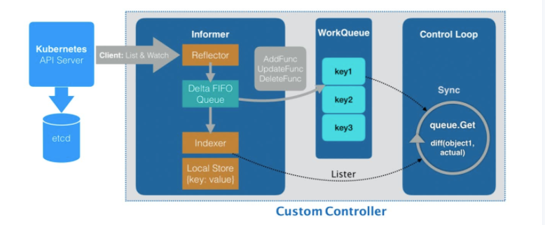

### k8s 资源创建流程

1. yaml信息提交给apisrver,过滤请求，完成一些前置性的工作，比如授权等；
2. 进入MUX和routes流程，找到对应资源类型；
3. 根据用户提交的yaml与资源类型创建一个资源对象(SuperVersion)；
4. 进行Admission和Validation（校验字段是否合法）
5. 将对象进行序列化操作，保存到ETCD

### 自定义控制器原理

Informer: 带有本地缓存和索引机制的，可以注册EventHandler的client。他是跟apiserver进行数据同步的主要组件

1. informer中的reflector通过listandwatch方法获取apiserver中的数据变化;
2. reflector收到事件通知，事件以及对象被放入delta fifo queue；
3. Informer不断的从delta queue中取，根据事件类型更新Locla Store；并调用事件的eventhandler，为保证缓存的有效性，每隔resyncPeriod时间会使用最近一次List结果重新强制刷新一遍，这个过程叫resync
4. informer完成一次本地缓存的同步操作后，启动一个或多个goroutine从工作队列里拿一个成员（也就是资源的名称），通过这个key从缓存中拿到资源对象；
5. 如果缓存对象中没有，则代表删除，如有有，则进行期望状态与实际状态额reconcile过程

### CRD 与 API Aggregator

